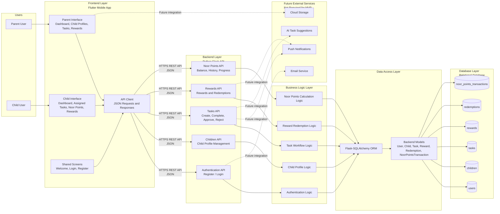
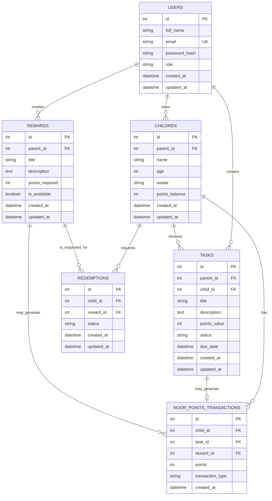
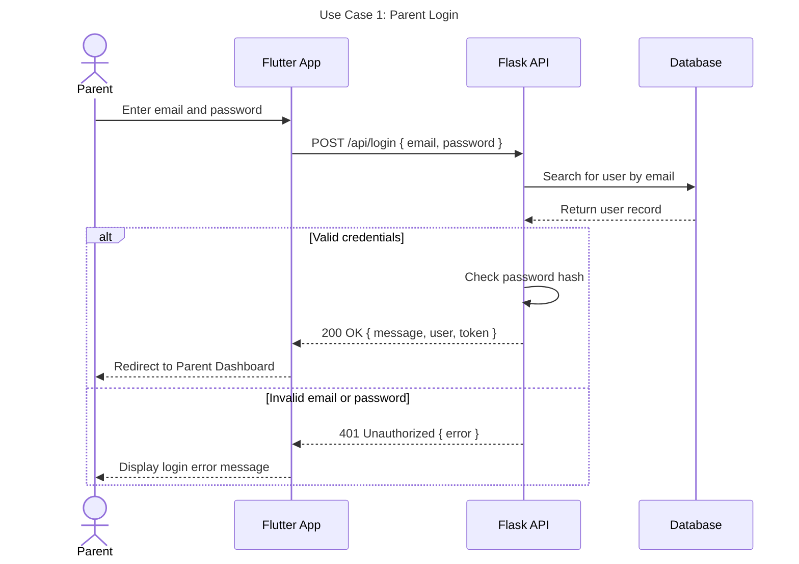
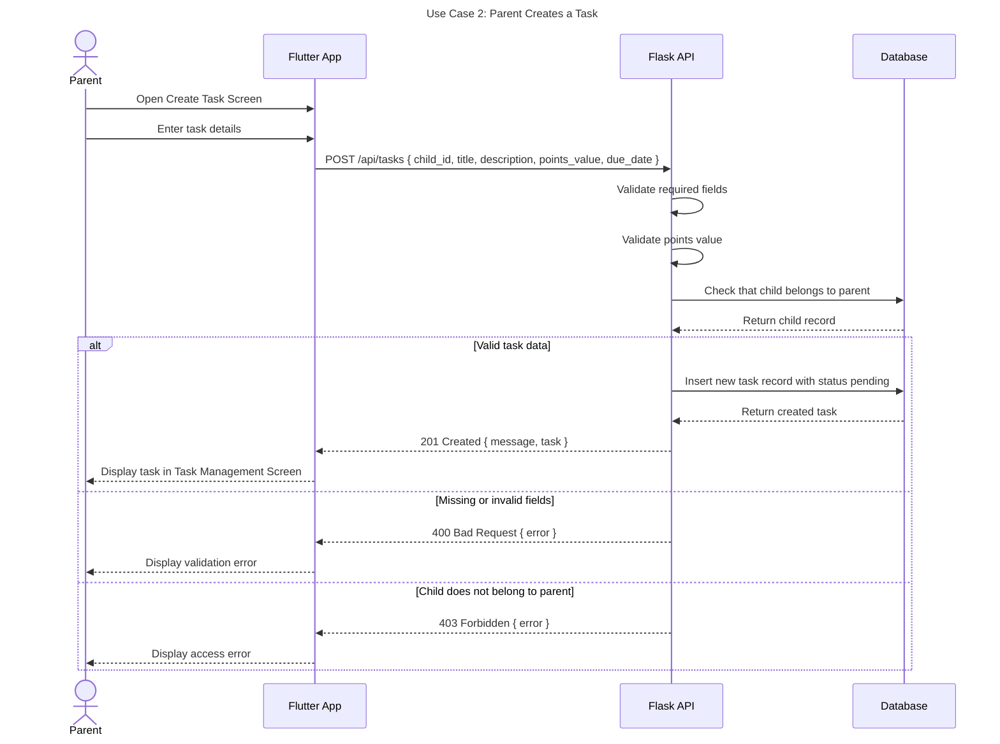
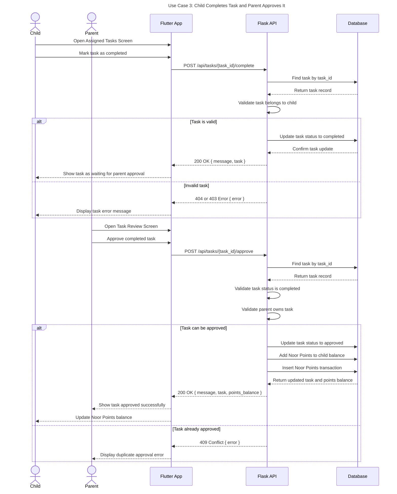
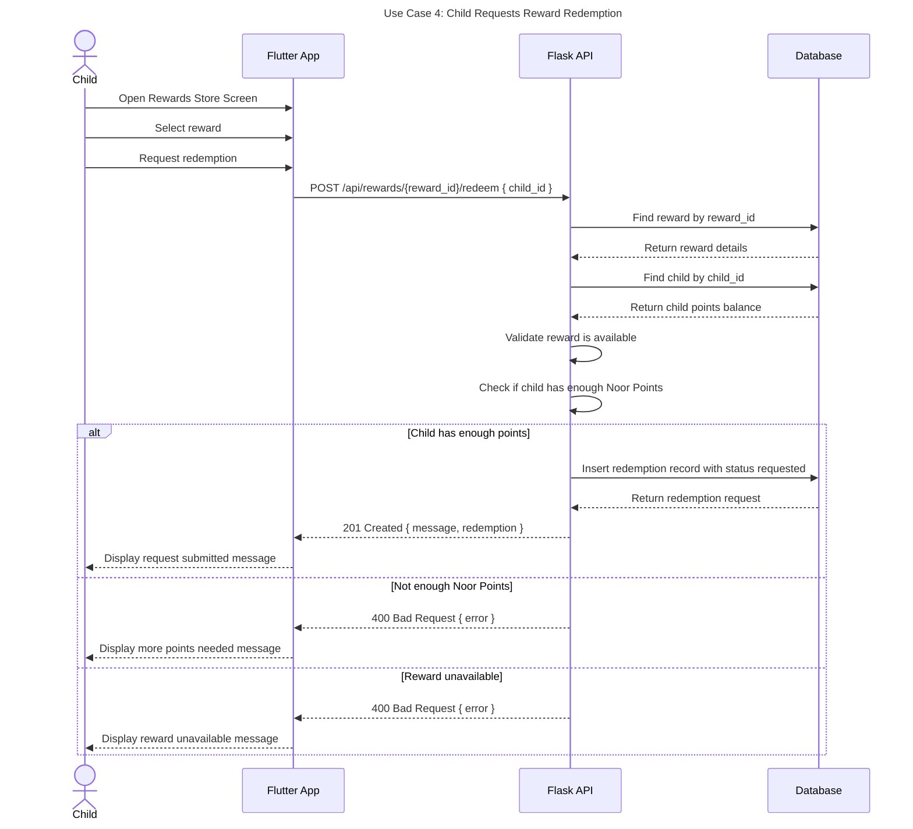

# Asalah - Technical Documentation

## Stage 3: Portfolio Project - Technical Documentation

---

## 1. Introduction

**Asalah** is a gamified value-based financial literacy platform designed for Saudi families. The project helps parents teach children responsible financial habits through meaningful tasks, rewards, and a points-based system called **Noor Points**.

This technical documentation translates the project objectives and requirements into a detailed technical plan for the MVP. It includes user stories, mockup planning, system architecture, components, backend classes, database design, sequence diagrams, API specifications, source control management, quality assurance strategies, and technical justifications.

The goal of this document is to provide a clear blueprint for building the Asalah MVP and to align the team on the project’s technical direction.

---

## 2. MVP Scope

The MVP will include two main interfaces:

* Parent Interface
* Child Interface

### Parent MVP Features

* Register and log in
* Create and manage child profiles
* Create and assign tasks
* Assign Noor Points to tasks
* Review completed tasks
* Approve or reject completed tasks
* Create and manage rewards
* Approve or reject reward redemption requests
* Track child progress

### Child MVP Features

* View assigned tasks
* Mark tasks as completed
* View Noor Points balance
* View available rewards
* Request reward redemption
* Track basic progress

### Features Not Included in MVP

The following features may be considered in future versions but are not required for the MVP:

* AI-generated task suggestions
* Push notifications
* Advanced badges and achievements
* Family challenges
* Advanced analytics
* Avatar customization
* Payment integration

---

## 3. User Stories and Mockups

### 3.1 Purpose

The purpose of this section is to define the main MVP features from the user’s perspective. User stories help the team understand what each user needs to do in the application and why each feature matters.

Since Asalah includes a mobile user interface, mockups will be created for the main screens to visualize the user experience before implementation.

---

## 3.2 User Types

| User Type | Description                                                                                            |
| --------- | ------------------------------------------------------------------------------------------------------ |
| Parent    | The main account owner who manages children, tasks, rewards, approvals, and progress.                  |
| Child     | The user who views tasks, completes tasks, earns Noor Points, views rewards, and requests redemptions. |

---

## 3.3 Prioritized User Stories

The user stories are prioritized using the MoSCoW method:

* **Must Have:** Required for the MVP.
* **Should Have:** Important but not critical for the first version.
* **Could Have:** Nice to include if time allows.
* **Won’t Have:** Not planned for the MVP.

---

### Must Have User Stories

| Priority  | User Story                                                                                                          |
| --------- | ------------------------------------------------------------------------------------------------------------------- |
| Must Have | As a parent, I want to create an account, so that I can manage my family’s financial learning experience.           |
| Must Have | As a parent, I want to log in securely, so that I can access my family dashboard.                                   |
| Must Have | As a parent, I want to create child profiles, so that each child can have their own tasks, points, and progress.    |
| Must Have | As a parent, I want to create tasks for my children, so that I can encourage responsible habits and learning.       |
| Must Have | As a parent, I want to assign Noor Points to each task, so that children understand the value of effort and reward. |
| Must Have | As a child, I want to view my assigned tasks, so that I know what I need to complete.                               |
| Must Have | As a child, I want to mark a task as completed, so that my parent can review it.                                    |
| Must Have | As a parent, I want to approve or reject completed tasks, so that Noor Points are only awarded after confirmation.  |
| Must Have | As a child, I want to earn Noor Points after completing approved tasks, so that I feel motivated to continue.       |
| Must Have | As a parent, I want to create rewards, so that children have meaningful goals to work toward.                       |
| Must Have | As a child, I want to view available rewards, so that I can choose what I want to redeem.                           |
| Must Have | As a child, I want to request a reward using my Noor Points, so that I can exchange progress for a reward.          |
| Must Have | As a parent, I want to approve or reject reward redemption requests, so that I can manage the reward process.       |

---

### Should Have User Stories

| Priority    | User Story                                                                                                                  |
| ----------- | --------------------------------------------------------------------------------------------------------------------------- |
| Should Have | As a parent, I want to view each child’s progress, so that I can understand their activity and improvement.                 |
| Should Have | As a child, I want to see my Noor Points balance, so that I can track how close I am to a reward.                           |
| Should Have | As a child, I want to see my completed tasks, so that I can feel proud of my progress.                                      |
| Should Have | As a parent, I want to edit or delete tasks, so that I can update responsibilities when needed.                             |
| Should Have | As a parent, I want to edit or delete rewards, so that I can manage reward options easily.                                  |
| Should Have | As a user, I want the application to support Arabic as the primary language, so that Saudi families can use it comfortably. |

---

### Could Have User Stories

| Priority   | User Story                                                                                                                  |
| ---------- | --------------------------------------------------------------------------------------------------------------------------- |
| Could Have | As a child, I want to see a progress star for Noor Points, so that I can visually understand my growth.                     |
| Could Have | As a parent, I want to receive notifications when a task is completed, so that I can review it quickly.                     |
| Could Have | As a user, I want to switch between Arabic and English, so that the application can support different language preferences. |
| Could Have | As a parent, I want to create recurring tasks, so that I do not need to repeat the same task manually.                      |

---

### Won’t Have for MVP

| Priority   | User Story                                                                                           |
| ---------- | ---------------------------------------------------------------------------------------------------- |
| Won’t Have | As a parent, I want AI-generated task suggestions, so that I can receive automatic task ideas.       |
| Won’t Have | As a family, I want to join family challenges, so that multiple children can compete or collaborate. |
| Won’t Have | As a parent, I want advanced analytics reports, so that I can study long-term behavior trends.       |
| Won’t Have | As a child, I want to customize my avatar, so that I can personalize my profile.                     |
| Won’t Have | As a user, I want push notifications, so that I can receive updates outside the app.                 |

---

## 3.4 Mockups

Mockups will be created using **Figma** because it is collaborative, accessible, and suitable for mobile application design.

The mockups will follow these design principles:

* Arabic-first interface
* Right-to-left layout
* Lavender as the primary color
* Gold star as the Noor Points visual symbol
* Simple child-friendly language
* Clear navigation for parents and children
* Calm and family-friendly visual style

### Main Mockup Screens

| Screen                      | Description                                                    |
| --------------------------- | -------------------------------------------------------------- |
| Welcome / Onboarding Screen | Introduces Asalah and explains its purpose.                    |
| Login Screen                | Allows parents to log in securely.                             |
| Register Screen             | Allows parents to create a new account.                        |
| Parent Dashboard            | Shows children, tasks, pending approvals, points, and rewards. |
| Child Profiles Screen       | Allows the parent to view and manage child profiles.           |
| Create Child Profile Screen | Allows the parent to add a child profile.                      |
| Task Management Screen      | Allows the parent to view, create, edit, and delete tasks.     |
| Create Task Screen          | Allows the parent to create and assign a task.                 |
| Task Review Screen          | Allows the parent to approve or reject completed tasks.        |
| Reward Management Screen    | Allows the parent to create and manage rewards.                |
| Child Dashboard             | Shows the child’s tasks, Noor Points, progress, and rewards.   |
| Assigned Tasks Screen       | Allows the child to view and complete assigned tasks.          |
| Noor Points Screen          | Shows the child’s current Noor Points balance and progress.    |
| Rewards Store Screen        | Shows available rewards.                                       |
| Reward Request Screen       | Allows the child to request a reward.                          |

---

## 4. System Architecture

### 4.1 Purpose

The purpose of this section is to define the high-level architecture of the Asalah MVP and show how the main components interact.

Asalah will use a **client-server architecture**. The Flutter mobile application will communicate with the Flask backend through RESTful API requests using JSON. The backend will process business logic, interact with the database through Flask-SQLAlchemy, and return JSON responses to the frontend.

---

## 4.2 High-Level System Architecture Diagram



---

## 4.3 System Architecture Explanation

The system architecture is divided into clear layers:

| Layer                    | Description                                                                                  |
| ------------------------ | -------------------------------------------------------------------------------------------- |
| Users                    | Parent and child users who interact with the mobile application.                             |
| Frontend Layer           | Flutter mobile app containing parent screens, child screens, shared screens, and API client. |
| Backend Layer            | Flask REST API that receives requests and returns JSON responses.                            |
| Business Logic Layer     | Handles application rules such as task approval, reward redemption, and points calculation.  |
| Data Access Layer        | Uses Flask-SQLAlchemy ORM to connect backend models to database tables.                      |
| Database Layer           | Stores users, children, tasks, rewards, redemptions, and Noor Points transactions.           |
| Future External Services | Services that may be added later but are not required for the MVP.                           |

---

## 4.4 System Architecture Justification

Flutter was selected because it supports cross-platform mobile development from one codebase. This allows the team to build a consistent mobile experience for Android and iOS.

Python Flask was selected because it is lightweight, flexible, and suitable for building RESTful APIs for an MVP.

Flask-SQLAlchemy was selected because it allows the team to represent database tables as Python models and interact with the database in a cleaner way.

A layered architecture was selected because it separates responsibilities between the frontend, backend API, business logic, data access, and database. This improves maintainability, testing, and future scalability.

---

## 5. Components, Classes, and Database Design

### 5.1 Purpose

The purpose of this section is to define the internal structure of the Asalah MVP. This includes frontend components, backend classes, database tables, and relationships.

---

## 5.2 Frontend Components

The frontend will be developed using Flutter. It will include shared screens, parent-specific screens, and child-specific screens.

| Component                | Description                                |
| ------------------------ | ------------------------------------------ |
| WelcomeScreen            | Introduces the application.                |
| LoginScreen              | Handles parent login.                      |
| RegisterScreen           | Handles parent registration.               |
| ParentDashboard          | Shows parent overview.                     |
| ChildProfilesScreen      | Displays and manages child profiles.       |
| CreateChildProfileScreen | Allows parent to create a child profile.   |
| TaskManagementScreen     | Displays and manages tasks.                |
| CreateTaskScreen         | Allows parent to create tasks.             |
| TaskReviewScreen         | Allows parent to approve or reject tasks.  |
| RewardManagementScreen   | Displays and manages rewards.              |
| CreateRewardScreen       | Allows parent to create rewards.           |
| ChildDashboard           | Shows child tasks, points, and rewards.    |
| AssignedTasksScreen      | Displays assigned tasks.                   |
| TaskDetailsScreen        | Shows task details.                        |
| NoorPointsScreen         | Displays points balance and history.       |
| RewardsStoreScreen       | Displays available rewards.                |
| RewardRequestScreen      | Allows child to request reward redemption. |
| ProgressScreen           | Shows child progress.                      |

---

## 5.3 Backend Classes

The backend will be developed using Python Flask and Flask-SQLAlchemy. The main backend classes will represent the core business objects in the application.

### User Class

The `User` class represents the parent account.

| Attribute     | Type     | Description                 |
| ------------- | -------- | --------------------------- |
| id            | Integer  | Unique user ID.             |
| full_name     | String   | Parent full name.           |
| email         | String   | Parent email address.       |
| password_hash | String   | Hashed password.            |
| role          | String   | User role, default: parent. |
| created_at    | DateTime | Account creation date.      |
| updated_at    | DateTime | Last update date.           |

| Method                   | Description                                           |
| ------------------------ | ----------------------------------------------------- |
| set_password(password)   | Hashes and stores the password.                       |
| check_password(password) | Validates entered password against the password hash. |
| to_dict()                | Converts user object to dictionary format.            |

---

### Child Class

The `Child` class represents a child profile created by a parent.

| Attribute      | Type     | Description                  |
| -------------- | -------- | ---------------------------- |
| id             | Integer  | Unique child ID.             |
| parent_id      | Integer  | Foreign key linked to user.  |
| name           | String   | Child name.                  |
| age            | Integer  | Child age.                   |
| avatar         | String   | Optional avatar reference.   |
| points_balance | Integer  | Current Noor Points balance. |
| created_at     | DateTime | Profile creation date.       |
| updated_at     | DateTime | Last update date.            |

| Method                | Description                                  |
| --------------------- | -------------------------------------------- |
| add_points(points)    | Adds Noor Points to the child balance.       |
| deduct_points(points) | Deducts Noor Points after reward redemption. |
| to_dict()             | Converts child object to dictionary format.  |

---

### Task Class

The `Task` class represents a task created by a parent and assigned to a child.

| Attribute    | Type     | Description                                |
| ------------ | -------- | ------------------------------------------ |
| id           | Integer  | Unique task ID.                            |
| parent_id    | Integer  | Foreign key linked to user.                |
| child_id     | Integer  | Foreign key linked to child.               |
| title        | String   | Task title.                                |
| description  | Text     | Task description.                          |
| points_value | Integer  | Noor Points assigned to the task.          |
| status       | String   | pending, completed, approved, or rejected. |
| due_date     | DateTime | Optional due date.                         |
| created_at   | DateTime | Task creation date.                        |
| updated_at   | DateTime | Last update date.                          |

| Method           | Description                                |
| ---------------- | ------------------------------------------ |
| mark_completed() | Updates task status to completed.          |
| approve_task()   | Updates task status to approved.           |
| reject_task()    | Updates task status to rejected.           |
| to_dict()        | Converts task object to dictionary format. |

---

### Reward Class

The `Reward` class represents a reward created by a parent.

| Attribute       | Type     | Description                                |
| --------------- | -------- | ------------------------------------------ |
| id              | Integer  | Unique reward ID.                          |
| parent_id       | Integer  | Foreign key linked to user.                |
| title           | String   | Reward title.                              |
| description     | Text     | Reward description.                        |
| points_required | Integer  | Noor Points required to redeem the reward. |
| is_available    | Boolean  | Reward availability status.                |
| created_at      | DateTime | Reward creation date.                      |
| updated_at      | DateTime | Last update date.                          |

| Method              | Description                                  |
| ------------------- | -------------------------------------------- |
| activate_reward()   | Makes reward available.                      |
| deactivate_reward() | Makes reward unavailable.                    |
| to_dict()           | Converts reward object to dictionary format. |

---

### Redemption Class

The `Redemption` class represents a child’s request to redeem a reward.

| Attribute  | Type     | Description                       |
| ---------- | -------- | --------------------------------- |
| id         | Integer  | Unique redemption ID.             |
| child_id   | Integer  | Foreign key linked to child.      |
| reward_id  | Integer  | Foreign key linked to reward.     |
| status     | String   | requested, approved, or rejected. |
| created_at | DateTime | Request creation date.            |
| updated_at | DateTime | Last update date.                 |

| Method               | Description                                      |
| -------------------- | ------------------------------------------------ |
| approve_redemption() | Approves the reward redemption.                  |
| reject_redemption()  | Rejects the reward redemption.                   |
| to_dict()            | Converts redemption object to dictionary format. |

---

### NoorPointsTransaction Class

The `NoorPointsTransaction` class stores the history of earned, redeemed, or adjusted Noor Points.

| Attribute        | Type     | Description                            |
| ---------------- | -------- | -------------------------------------- |
| id               | Integer  | Unique transaction ID.                 |
| child_id         | Integer  | Foreign key linked to child.           |
| task_id          | Integer  | Optional foreign key linked to task.   |
| reward_id        | Integer  | Optional foreign key linked to reward. |
| points           | Integer  | Number of points added or deducted.    |
| transaction_type | String   | earned, redeemed, or adjusted.         |
| created_at       | DateTime | Transaction creation date.             |

| Method                        | Description                                       |
| ----------------------------- | ------------------------------------------------- |
| create_earned_transaction()   | Records points earned from an approved task.      |
| create_redeemed_transaction() | Records points deducted after reward redemption.  |
| to_dict()                     | Converts transaction object to dictionary format. |

---

## 5.4 Database Design

Asalah will use a relational database because the MVP includes structured data with clear relationships between parents, children, tasks, rewards, redemptions, and Noor Points.

### Database Tables

| Table                    | Purpose                                            |
| ------------------------ | -------------------------------------------------- |
| users                    | Stores parent account information.                 |
| children                 | Stores child profiles.                             |
| tasks                    | Stores assigned tasks and task statuses.           |
| rewards                  | Stores rewards created by parents.                 |
| redemptions              | Stores child reward redemption requests.           |
| noor_points_transactions | Stores history of earned and redeemed Noor Points. |

---

## 5.5 ER Diagram



---

## 5.6 Database Design Justification

A relational database was selected because Asalah contains structured data with clear relationships. One parent can have many children, each child can have many tasks, and each child can have a history of Noor Points transactions.

The `noor_points_transactions` table is separated from the `children` table because the application needs to track the history of how points were earned, redeemed, or adjusted. This improves transparency and makes progress tracking more accurate.

---

## 6. High-Level Sequence Diagrams

### 6.1 Purpose

The purpose of this section is to show how components interact during key Asalah MVP use cases.

The sequence diagrams include the following components:

| Component   | Description                        |
| ----------- | ---------------------------------- |
| Parent      | Parent user using the application. |
| Child       | Child user using the application.  |
| Flutter App | Mobile frontend.                   |
| Flask API   | Backend server.                    |
| Database    | Data storage layer.                |

The key interactions selected are:

1. Parent login
2. Parent creates a task
3. Child completes a task and parent approves it
4. Child requests reward redemption

---

## 6.2 Parent Login Sequence Diagram



---

## 6.3 Parent Creates Task Sequence Diagram



---

## 6.4 Child Completes Task and Parent Approves It Sequence Diagram



---

## 6.5 Reward Redemption Sequence Diagram



---

## 6.6 Sequence Diagram Justification

The selected sequence diagrams represent the most important MVP flows:

* Parent login
* Task creation
* Task completion and parent approval
* Noor Points update
* Reward redemption request

These interactions are central to the value of Asalah because they connect task responsibility, parent confirmation, points, and rewards.

---

## 7. External and Internal APIs

### 7.1 Purpose

The purpose of this section is to define how the Asalah system communicates with external services and how the frontend communicates with the backend through internal REST API endpoints.

---

## 7.2 External APIs

For the MVP version of Asalah, no external APIs are required.

The core MVP features can be implemented using the Flutter frontend, Flask backend, and relational database.

Possible future external services include:

| External API / Service    | Possible Use                                                    | MVP Status          |
| ------------------------- | --------------------------------------------------------------- | ------------------- |
| Email Service API         | Account verification and password reset.                        | Not included in MVP |
| Push Notification Service | Notify parents when children complete tasks or request rewards. | Not included in MVP |
| AI Service API            | Suggest age-appropriate tasks for children.                     | Not included in MVP |
| Cloud Storage API         | Store child avatars or uploaded media.                          | Not included in MVP |
| Payment API               | Not required because Noor Points are not real money.            | Not included in MVP |

---

## 7.3 Internal API Overview

| Item            | Format                             |
| --------------- | ---------------------------------- |
| Protocol        | HTTP / HTTPS                       |
| API Style       | REST                               |
| Request Format  | JSON                               |
| Response Format | JSON                               |
| Authentication  | Token-based authentication planned |
| Base URL        | `/api`                             |

---

## 7.4 Authentication Endpoints

### Register Parent Account

| Field         | Description                  |
| ------------- | ---------------------------- |
| URL Path      | `/api/register`              |
| HTTP Method   | `POST`                       |
| Purpose       | Create a new parent account. |
| Input Format  | JSON                         |
| Output Format | JSON                         |

Request body:

```json
{
  "full_name": "Parent User",
  "email": "parent@example.com",
  "password": "securePassword123"
}
```

Success response:

```json
{
  "message": "Account created successfully",
  "user": {
    "id": 1,
    "full_name": "Parent User",
    "email": "parent@example.com",
    "role": "parent"
  }
}
```

---

### Login

| Field         | Description                                              |
| ------------- | -------------------------------------------------------- |
| URL Path      | `/api/login`                                             |
| HTTP Method   | `POST`                                                   |
| Purpose       | Authenticate a parent and allow access to the dashboard. |
| Input Format  | JSON                                                     |
| Output Format | JSON                                                     |

Request body:

```json
{
  "email": "parent@example.com",
  "password": "securePassword123"
}
```

Success response:

```json
{
  "message": "Login successful",
  "token": "example-auth-token",
  "user": {
    "id": 1,
    "full_name": "Parent User",
    "email": "parent@example.com",
    "role": "parent"
  }
}
```

---

## 7.5 Child Profile Endpoints

| Endpoint                   | Method | Purpose                                                        |
| -------------------------- | ------ | -------------------------------------------------------------- |
| `/api/children`            | GET    | Retrieve all child profiles connected to the logged-in parent. |
| `/api/children`            | POST   | Create a new child profile.                                    |
| `/api/children/<child_id>` | PUT    | Update a child profile.                                        |
| `/api/children/<child_id>` | DELETE | Delete a child profile.                                        |

Example create child request:

```json
{
  "name": "Child User",
  "age": 10,
  "avatar": "star_avatar.png"
}
```

Example response:

```json
{
  "message": "Child profile created successfully",
  "child": {
    "id": 1,
    "name": "Child User",
    "age": 10,
    "avatar": "star_avatar.png",
    "points_balance": 0
  }
}
```

---

## 7.6 Task Endpoints

| Endpoint                        | Method | Purpose                                             |
| ------------------------------- | ------ | --------------------------------------------------- |
| `/api/tasks`                    | GET    | Retrieve tasks.                                     |
| `/api/tasks`                    | POST   | Create a new task and assign it to a child.         |
| `/api/tasks/<task_id>`          | PUT    | Update an existing task.                            |
| `/api/tasks/<task_id>`          | DELETE | Delete a task.                                      |
| `/api/tasks/<task_id>/complete` | POST   | Mark a task as completed.                           |
| `/api/tasks/<task_id>/approve`  | POST   | Approve a completed task and add Noor Points.       |
| `/api/tasks/<task_id>/reject`   | POST   | Reject a completed task without adding Noor Points. |

Example create task request:

```json
{
  "child_id": 1,
  "title": "Organize study desk",
  "description": "Clean and organize the study desk.",
  "points_value": 10,
  "due_date": "2026-06-30"
}
```

Example response:

```json
{
  "message": "Task created successfully",
  "task": {
    "id": 1,
    "child_id": 1,
    "title": "Organize study desk",
    "description": "Clean and organize the study desk.",
    "points_value": 10,
    "status": "pending",
    "due_date": "2026-06-30"
  }
}
```

---

## 7.7 Reward and Redemption Endpoints

| Endpoint                                   | Method | Purpose                     |
| ------------------------------------------ | ------ | --------------------------- |
| `/api/rewards`                             | GET    | Retrieve available rewards. |
| `/api/rewards`                             | POST   | Create a new reward.        |
| `/api/rewards/<reward_id>`                 | PUT    | Update reward details.      |
| `/api/rewards/<reward_id>`                 | DELETE | Delete a reward.            |
| `/api/rewards/<reward_id>/redeem`          | POST   | Request reward redemption.  |
| `/api/redemptions/<redemption_id>/approve` | POST   | Approve reward redemption.  |
| `/api/redemptions/<redemption_id>/reject`  | POST   | Reject reward redemption.   |

Example create reward request:

```json
{
  "title": "Family movie night",
  "description": "Choose a movie for family night.",
  "points_required": 50,
  "is_available": true
}
```

Example reward response:

```json
{
  "message": "Reward created successfully",
  "reward": {
    "id": 1,
    "title": "Family movie night",
    "description": "Choose a movie for family night.",
    "points_required": 50,
    "is_available": true
  }
}
```

---

## 7.8 Noor Points and Progress Endpoints

| Endpoint                                  | Method | Purpose                                         |
| ----------------------------------------- | ------ | ----------------------------------------------- |
| `/api/children/<child_id>/points`         | GET    | Retrieve a child’s current Noor Points balance. |
| `/api/children/<child_id>/points/history` | GET    | Retrieve Noor Points transaction history.       |
| `/api/children/<child_id>/progress`       | GET    | Retrieve a simple child progress summary.       |

Example points response:

```json
{
  "child_id": 1,
  "points_balance": 130
}
```

Example progress response:

```json
{
  "child_id": 1,
  "completed_tasks": 8,
  "approved_tasks": 6,
  "rejected_tasks": 2,
  "points_balance": 130,
  "redeemed_rewards": 1
}
```

---

## 7.9 Common Error Responses

Validation error:

```json
{
  "error": "Missing required fields"
}
```

Unauthorized error:

```json
{
  "error": "Authentication required"
}
```

Forbidden error:

```json
{
  "error": "You do not have permission to access this resource"
}
```

Not found error:

```json
{
  "error": "Resource not found"
}
```

Server error:

```json
{
  "error": "Internal server error"
}
```

---

## 7.10 API Design Justification

RESTful API design was selected because it provides a clear and organized way for the Flutter frontend to communicate with the Flask backend.

JSON was selected because it is lightweight, readable, and commonly used in mobile applications.

Swagger/OpenAPI will be used to document backend API endpoints and support API testing.

External APIs are excluded from the MVP because the current version can deliver the main product value without third-party services.

---

## 8. Source Control Management Strategy

### 8.1 Purpose

The purpose of this section is to define how the team will manage source code and collaborate during development.

The team will use **Git** for version control and **GitHub** for repository hosting, pull requests, code reviews, and documentation.

---

## 8.2 Branching Strategy

| Branch        | Purpose                                                                 |
| ------------- | ----------------------------------------------------------------------- |
| `main`        | Stable production-ready version of the project.                         |
| `development` | Main working branch where completed features are merged before release. |
| `feature/*`   | Branches created for individual features.                               |
| `fix/*`       | Branches created for bug fixes.                                         |
| `docs/*`      | Branches created for documentation updates.                             |

### Branch Name Examples

```bash
feature/user-authentication
feature/create-child-profile
feature/task-management
feature/noor-points-system
feature/reward-redemption
fix/login-validation-error
docs/stage-3-technical-documentation
```

---

## 8.3 Git Workflow

The team will follow this workflow:

```txt
Create branch from development
        |
Work on feature or fix
        |
Commit changes regularly
        |
Push branch to GitHub
        |
Open Pull Request
        |
Code review
        |
Merge into development
        |
Run QA testing
        |
Merge stable version into main
```

---

## 8.4 Commit Strategy

The team will make regular commits with clear and meaningful messages.

Example commit messages:

```bash
git commit -m "Add parent registration endpoint"
git commit -m "Create child profile model"
git commit -m "Build parent dashboard screen"
git commit -m "Implement task approval logic"
git commit -m "Add Noor Points transaction table"
git commit -m "Add Swagger API documentation"
git commit -m "Update technical documentation"
```

### Commit Guidelines

* Commit small and meaningful changes.
* Use clear messages.
* Avoid committing broken code to shared branches.
* Pull latest changes before starting work.
* Do not commit passwords, tokens, or secrets.
* Use `.gitignore` to exclude unnecessary files.

---

## 8.5 Pull Request and Code Review Strategy

Each completed feature should be submitted through a Pull Request before being merged into `development`.

Pull Requests should include:

* Clear title
* Short description
* Related feature or issue
* Screenshots for frontend changes
* API request/response examples for backend changes
* Swagger documentation updates for API changes
* Testing notes

Before merging, reviewers should check:

* Code matches the requirement
* Code is readable and organized
* API endpoints return clear JSON responses
* Swagger documentation is updated
* Database changes are correct
* No sensitive data is included
* Documentation is updated when needed

---

## 8.6 SCM Justification

Git and GitHub were selected because they support team collaboration, version control, branching, pull requests, code reviews, and project history tracking.

A simple branching strategy was selected because Asalah is an MVP project. It gives the team structure without adding unnecessary complexity.

---

## 9. Quality Assurance Strategy

### 9.1 Purpose

Quality Assurance will be used to confirm that Asalah works correctly, securely, and consistently before deployment.

Testing will cover:

* Backend APIs
* Frontend screens
* Database operations
* Frontend-backend integration
* Complete user flows
* Arabic interface and RTL layout

---

## 9.2 Testing Types

| Testing Type            | Purpose                                                                     |
| ----------------------- | --------------------------------------------------------------------------- |
| Unit Testing            | Test individual backend functions and frontend components.                  |
| API Testing             | Test backend endpoints and JSON responses.                                  |
| Swagger-Based Testing   | Test endpoints using interactive Swagger UI.                                |
| Integration Testing     | Test communication between Flutter frontend and Flask backend.              |
| Manual UI Testing       | Test Arabic interface, RTL layout, navigation, and usability.               |
| End-to-End Testing      | Test full user flows from registration to reward redemption.                |
| User Acceptance Testing | Confirm that the MVP is understandable and useful for parents and children. |

---

## 9.3 Testing Tools

| Area                | Tool                                  | Purpose                                                                |
| ------------------- | ------------------------------------- | ---------------------------------------------------------------------- |
| Backend Testing     | Pytest                                | Test Flask backend logic, models, and business rules.                  |
| API Documentation   | Swagger / OpenAPI                     | Document endpoints, request bodies, parameters, responses, and errors. |
| API Testing         | Swagger UI                            | Test endpoints directly from the browser.                              |
| API Testing         | Postman                               | Test API requests and scenarios manually.                              |
| Frontend Testing    | Flutter Test                          | Test Flutter widgets and frontend logic.                               |
| Integration Testing | Swagger UI / Postman / Manual Testing | Verify frontend-backend communication.                                 |
| Database Testing    | Flask-SQLAlchemy / Test Database      | Test models, relationships, and queries.                               |

---

## 9.4 Key QA Flows

### Task Completion and Noor Points Flow

```txt
Parent registers or logs in
        |
Parent creates child profile
        |
Parent creates task
        |
Child views assigned task
        |
Child marks task as completed
        |
Parent reviews completed task
        |
Parent approves task
        |
Noor Points are added to child balance
        |
Noor Points transaction is created
```

### Reward Redemption Flow

```txt
Parent creates reward
        |
Child views rewards store
        |
Child requests reward
        |
System checks Noor Points balance
        |
Parent reviews redemption request
        |
Parent approves redemption
        |
Noor Points are deducted
        |
Redeemed points transaction is created
```

---

## 9.5 QA Checklist Before Merging

Before merging a feature into `development`, the team should confirm:

* Feature works locally
* Code does not break existing features
* Required fields are validated
* Error messages are clear
* API responses are in JSON format
* Swagger documentation is updated for new or changed endpoints
* Swagger UI testing has been performed for backend endpoint changes
* Database changes work correctly
* Frontend screens display correct data
* Arabic layout is readable
* No sensitive data is committed
* Documentation is updated if needed

---

## 9.6 QA Justification

Pytest was selected because it works well with Python and Flask applications.

Swagger/OpenAPI was added because it provides interactive API documentation and allows the team to test backend endpoints directly from the browser.

Postman supports detailed API request testing and repeated test scenarios.

Flutter Test supports testing Flutter widgets and frontend logic.

Manual UI testing is necessary because Asalah has an Arabic-first, child-friendly interface that requires visual and usability review.

---

## 10. Deployment Plan

### 10.1 Development Environment

The development environment will be used by the team while building features.

```txt
Flutter app running on emulator or physical device
Flask backend running locally
Local development database
Swagger UI available for local API testing
```

---

## 10.2 Staging Environment

The staging environment will be used to test the application before release.

```txt
Stable development branch
Test database
Backend deployed to a test server or shared environment
Flutter app connected to staging API
Swagger UI available for API verification
```

---

## 10.3 Production Environment

The production environment will be used for the final stable MVP release.

```txt
main branch
Production backend server
Production database
Final mobile app build
```

---

## 10.4 Deployment Workflow

```txt
Feature branch completed
        |
Pull Request opened
        |
Code review completed
        |
Swagger API documentation checked
        |
Feature merged into development
        |
QA testing on development
        |
Stable version merged into main
        |
Deploy backend and database
        |
Build final Flutter app
        |
Run final MVP testing
        |
Release MVP
```

---

## 11. Technical Justifications Summary

| Technical Decision           | Justification                                                                               |
| ---------------------------- | ------------------------------------------------------------------------------------------- |
| Flutter frontend             | Supports cross-platform mobile development from one codebase.                               |
| Python Flask backend         | Lightweight, flexible, and suitable for RESTful MVP APIs.                                   |
| Flask-SQLAlchemy             | Simplifies database interaction using Python models.                                        |
| Relational database          | Fits structured data and relationships between users, children, tasks, rewards, and points. |
| REST API                     | Separates frontend and backend clearly.                                                     |
| JSON format                  | Lightweight and easy to use between mobile app and backend.                                 |
| Swagger/OpenAPI              | Documents and tests backend APIs interactively.                                             |
| Git and GitHub               | Supports collaboration, branching, pull requests, and code review.                          |
| MoSCoW prioritization        | Helps focus the MVP on essential features first.                                            |
| Arabic-first design          | Matches the target users: Saudi families.                                                   |
| Lavender visual identity     | Provides a calm, friendly, family-oriented design.                                          |
| Gold star Noor Points symbol | Represents growth, achievement, and motivation.                                             |

---

## 12. Conclusion

This technical documentation provides a complete blueprint for building the Asalah MVP. It defines user stories, mockups, system architecture, frontend components, backend classes, database design, sequence diagrams, API specifications, source control management, quality assurance strategies, deployment planning, and technical justifications.

The planned system is simple enough for MVP development while still supporting future growth. By separating the frontend, backend, business logic, data access, and database layers, the team can work collaboratively and build a clear, maintainable, and testable application.

The MVP focuses on the core value of Asalah: helping Saudi families teach children financial responsibility through tasks, Noor Points, rewards, and positive parent-child interaction.
