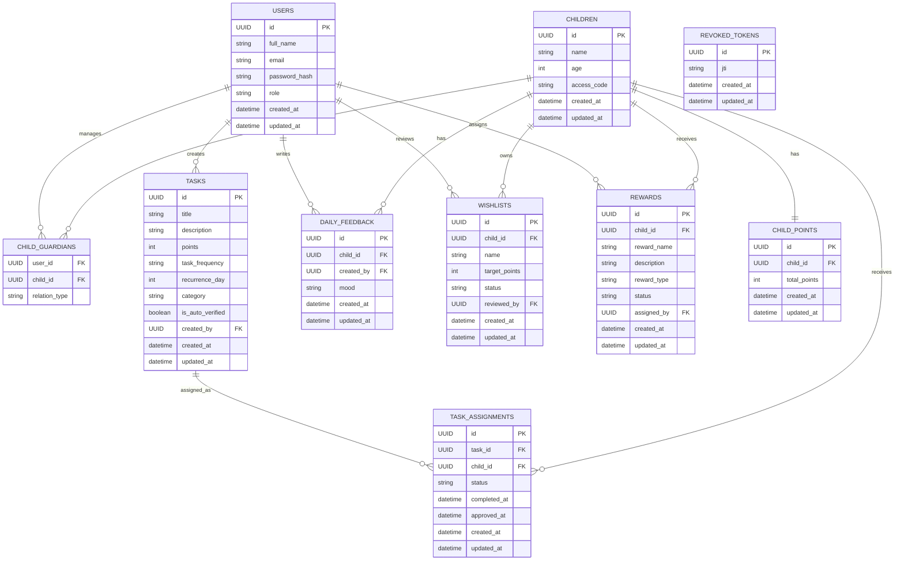
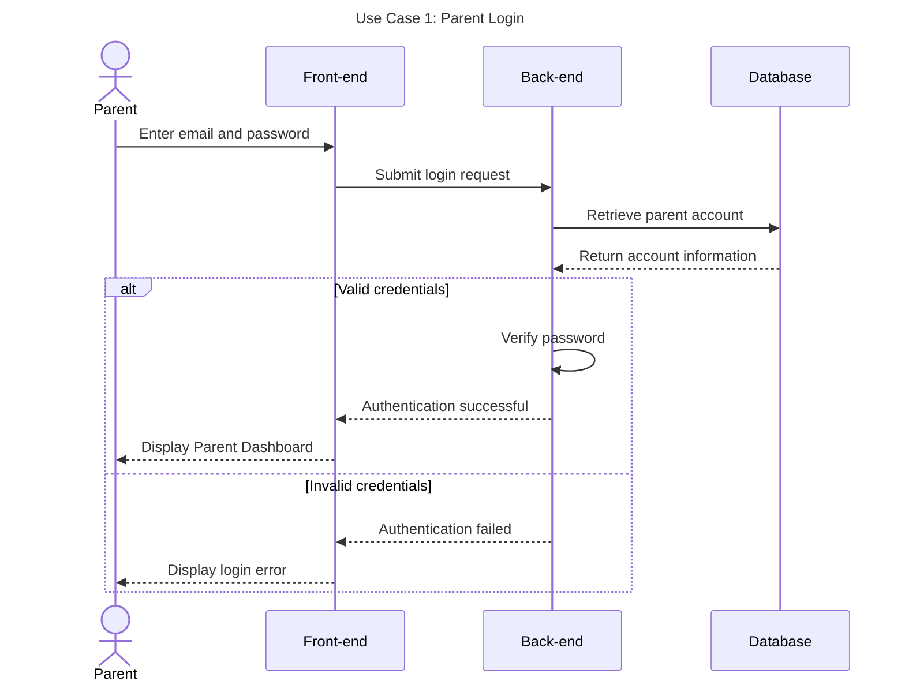
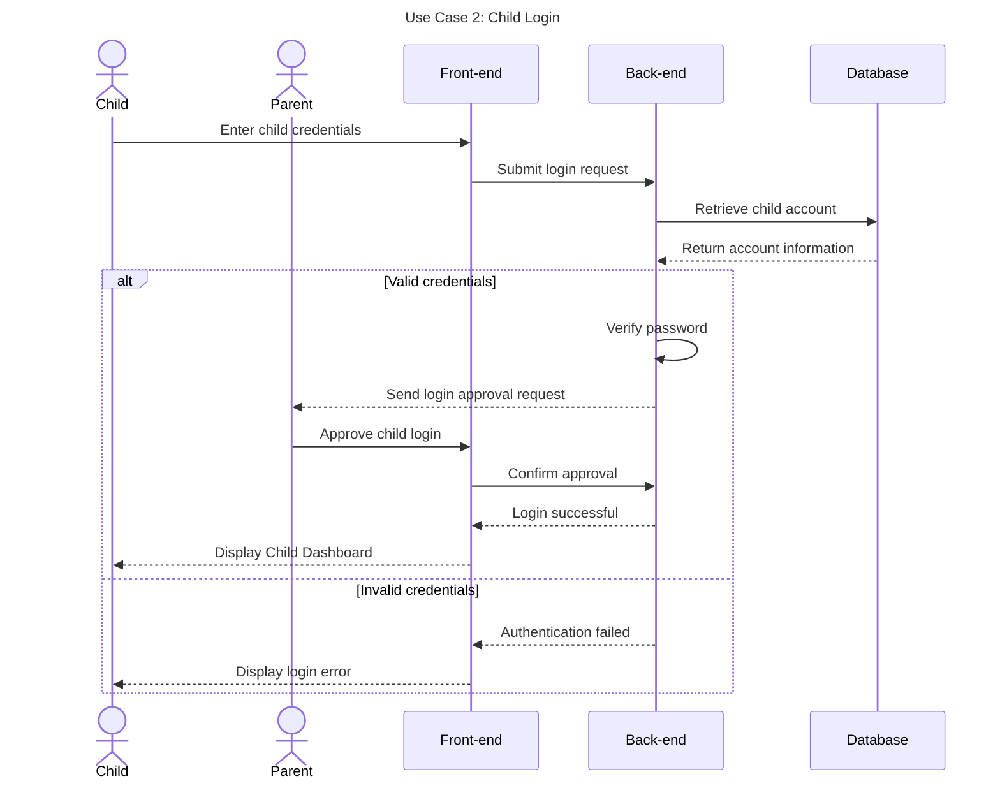
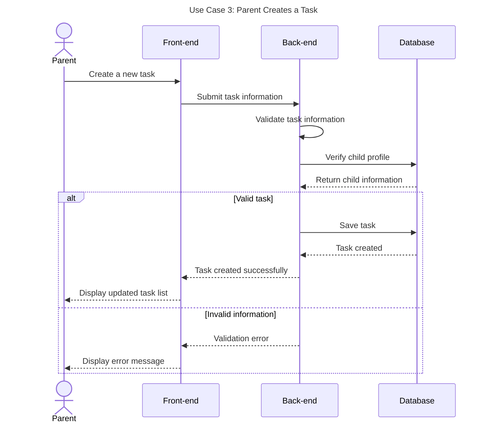
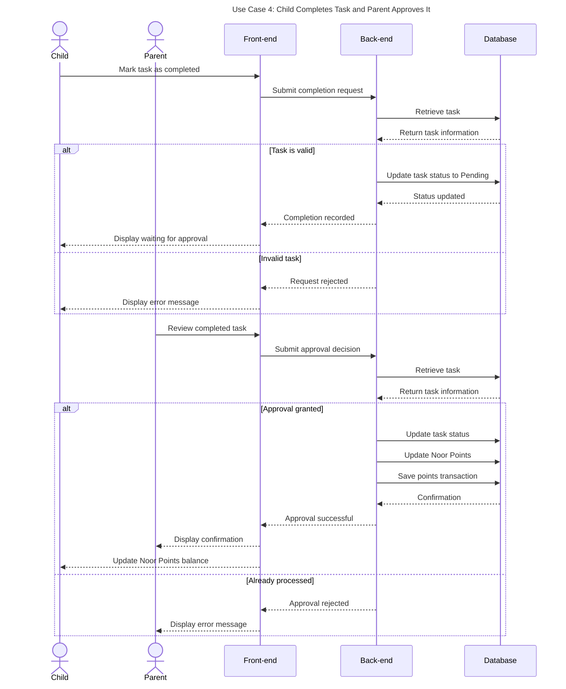
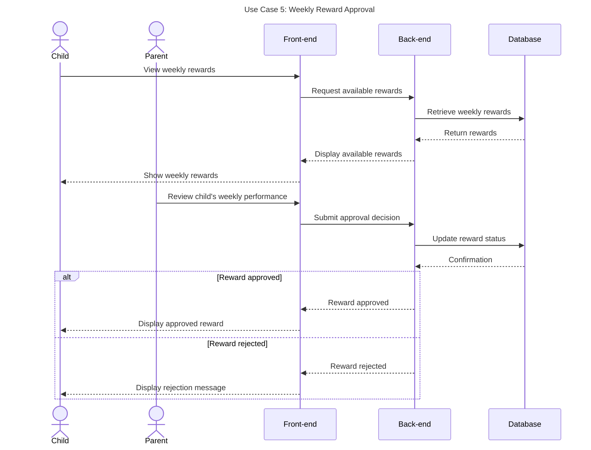

# Asalah - Technical Documentation

## Stage 3: Portfolio Project - Technical Documentation

---

## 1. Introduction

**Asalah** is a gamified value-based financial literacy platform designed for Saudi families. The project helps parents teach children responsible financial habits through meaningful tasks, rewards, and a points-based system called **Noor Points**.

This technical documentation translates the project objectives and requirements into a detailed technical plan for the MVP. It includes user stories, mockup planning, system architecture, components, backend classes, database design, sequence diagrams, API specifications, source control management, quality assurance strategies, and technical justifications.

The goal of this document is to provide a clear blueprint for building the Asalah MVP and to align the team on the project’s technical direction.

---
## 2. MVP Scope

The MVP is designed to provide a core functional loop for parents and children to manage tasks, Noor Points, the Wishlist, and rewards. It consists of two primary interfaces:

### 2.1 Parent Interface Features
*   **Authentication:** Register and secure login.
*   **Child Management:** Create and manage child profiles.
*   **Task Management:** Create, assign, and track tasks.
*   **Point System:** Assign specific Noor Points to individual tasks.
*   **Task Review:** Review, approve, or reject completed tasks.
*   **Reward Management:** Create and manage weekly rewards available for the child.
*   **Progress Tracking:** View and monitor individual child progress.

### 2.2 Child Interface Features
*   **Dashboard:** View assigned tasks.
*   **Interaction:** Mark tasks as completed to trigger parent review.
*   **Balance:** View current Noor Points balance.
*   **Wishlist:** Manage the list of desired items/wishes the child is collecting points for.
*   **Rewards:** View available rewards set by the parents.
*   **Progress:** Track personal task completion and point accumulation.

### 2.3 Features Out of Scope (Future Versions)
To ensure the MVP is completed within the project timeline, the following features are reserved for future updates:
*   **AI:** AI-generated task suggestions.
*   **Communication:** Push notifications.
*   **Gamification:** Advanced badges and complex achievements.
*   **Social:** Family challenges.
*   **Analytics:** Advanced behavioral analytics.
*   **Personalization:** Avatar customization.
*   **Financial:** Real-money payment integration.
---

## 3. User Stories and Mockups

### 3.1 Purpose

The purpose of this section is to define the main MVP features from the user’s perspective. User stories help the team understand what each user needs to do in the application and why each feature matters.

Since Asalah includes a mobile user interface, mockups will be created for the main screens to visualize the user experience before implementation.

---
## 3.2 User Types

| User Type | Description |
| --------- | ----------- |
| **Parent** | The administrator of the account. Responsible for managing child profiles, defining tasks with assigned Noor Points, approving task completions, creating reward pools, and monitoring overall behavioral progress. |
| **Child** | The end-user who interacts with the task list, marks tasks as completed, tracks their accumulated Noor Points, maintains a personalized "Wishlist," and views available rewards to work toward. |
---

## 3.3 Prioritized User Stories

The user stories are prioritized using the MoSCoW method:

* **Must Have:** Required for the MVP.
* **Should Have:** Important but not critical for the first version.
* **Could Have:** Nice to include if time allows.
* **Won’t Have:** Not planned for the MVP.

---
## 1. Must Have User Stories

| Priority | User Story |
| :--- | :--- |
| **Must Have** | As a parent, I want to create child profiles with a unique access code so each child can log in easily so that each child has their own profile. |
| **Must Have** | As a parent, I want to receive a verification code on my device when my child logs in, so that I can approve their access and secure the application. |
| **Must Have** | As a child, I want to log in using my access code my parents made for me and wait for their verification, so that I can access my screen safely. |
| **Must Have** | As a child, I want to see only my assigned tasks on my screen, so that I know exactly what I need to do. |
| **Must Have** | As a parent, I want to categorize tasks into Financial, Religious, and Daily lists, so that I can teach my child financial sense and the value of things. |
| **Must Have** | As a parent, I want to set the task frequency to daily, weekly, or just once a day, so that I can customize the routine for my child. |
| **Must Have** | As a child, I want to click "I completed the task" so that it goes to a "Pending" status, instead of giving me points right away. |
| **Must Have** | As a parent, I want to review the tasks my child marked as completed, so that I can click "Yes" and change its status to Completed. |
| **Must Have** | As a parent, I want an "Automatic Approval" option when creating a task, so that it skips the Pending status and gives points automatically. |
| **Must Have** | As a parent, I want to provide feedback using Emojis and a side comment box after confirming a task, so that I can motivate my child. |
| **Must Have** | As a child, I want to receive Noor Points instantly into my dashboard after parent approval, so that I can see my balance grow. |
| **Must Have** | As a child, I want to put exactly 5 wishes in my Wishlist, so that I can save my Noor Points to buy them. |
| **Must Have** | As a parent, I want to review my child's 5 wishes and approve between 1 and 3, so that I can control achievable goals. |
| **Must Have** | As a parent, I want to set a goal (e.g., 5,000 points) for the wishlist, so that I can teach my child commitment. |
| **Must Have** | As a child, I want to view available rewards every Thursday under 5 categories, regardless of parent approval status. |
| **Must Have** | As a parent, I want to choose from 5 system reward categories or write a custom reward, so that I can tailor the incentive. |
| **Must Have** | As a parent, I want to approve or deny the weekly reward based on my child's consistency, so that I can teach commitment. |
| **Must Have** | As a user, I want full support for the Arabic language, so that Saudi families can use the app comfortably. |
| **Must Have** | As a parent, I want to view each child’s progress history, so that I can understand their development. |
| **Must Have** | As a child, I want to see my total Noor Points balance, so that I can track my progress toward rewards. |
| **Must Have** | As a child, I want to view my previously completed tasks, so that I can feel proud of my achievements. |
| **Must Have** | As a parent, I want to edit or delete tasks, so that I can manage responsibilities when circumstances change. |
| **Must Have** | As a parent, I want to edit or delete rewards, so that I can manage incentives easily. |
| **Must Have** | As a child, I want to see a "Progress Star" for Noor Points, so that I can visually track my growth. |
| **Must Have** | As a user, I want to switch between Arabic and English languages, so that I have flexible usage options. |

---

## 2. Should Have User Stories

| Priority | User Story |
| :--- | :--- |
| **Should Have** | As a parent, I want to receive in-app notifications when a task is completed, so that I can review it promptly. |
| **Should Have** | As a parent, I want to view simple weekly performance statistics, so that I can identify the most consistent tasks. |
| **Should Have** | As a child, I want to see a progress bar for each wish, so that I know how many points I need to reach my goal. |
| **Should Have** | As a parent, I want an option to "Freeze Points," so that I can temporarily stop rewards if needed. |
| **Should Have** | As a user, I want a "Dark Mode" option, so that I can reduce eye strain during evening use. |
| **Should Have** | As a parent, I want to receive short weekly financial education tips, so that I can better guide my child. |

---

## 3. Could Have User Stories

| Priority | User Story |
| :--- | :--- |
| **Could Have** | As a parent, I want to export child performance reports (PDF), so that I can print or share them. |
| **Could Have** | As a parent, I want to create "Bonus Tasks" with double points, so that I can motivate my child for special efforts. |
| **Could Have** | As a child, I want to earn "Achievement Badges" for streaks, so that I feel more engaged. |
| **Could Have** | As a child, I want a "Forgot Password" feature via email, so that I can recover my account independently. |

---

## 4. Won’t Have for MVP

| Priority | User Story |
| :--- | :--- |
| **Won’t Have** | As a parent, I want AI-generated task suggestions, so that I can receive automatic task ideas. |
| **Won’t Have** | As a family, I want to join family challenges, so that multiple children can compete. |
| **Won’t Have** | As a parent, I want advanced behavior analytics reports, so that I can study long-term trends. |
| **Won’t Have** | As a child, I want to customize my avatar, so that I can personalize my profile. |
| **Won’t Have** | As a user, I want real-time Push Notifications outside the app, so that I stay updated. |
---

## 3.4 Mockups

Mockups will be created using **Figma** because it is collaborative, accessible, and suitable for mobile application design.

URL: https://www.figma.com/design/HbF4PEXKYssQPenE5rxNCr/Asalah-App-Mockups?node-id=0-1&t=3RT1nbYPW3UCWVBB-1

The mockups will follow these design principles:

* Arabic-first interface
* Right-to-left layout
* Lavender as the primary color
* Gold star as the Noor Points visual symbol
* Simple child-friendly language
* Clear navigation for parents and children
* Calm and family-friendly visual style

### Main Mockup Screens

| Screen                      | Description                                                    |
| --------------------------- | -------------------------------------------------------------- |
| Welcome / Onboarding Screen | Introduces Asalah and explains its purpose.                    |
| Login Screen                | Allows parents to log in securely.                             |
| Register Screen             | Allows parents to create a new account.                        |
| Parent Dashboard            | Shows children, tasks, pending approvals, points, and rewards. |
| Child Profiles Screen       | Allows the parent to view and manage child profiles.           |
| Create Child Profile Screen | Allows the parent to add a child profile.                      |
| Task Management Screen      | Allows the parent to view, create, edit, and delete tasks.     |
| Create Task Screen          | Allows the parent to create and assign a task.                 |
| Task Review Screen          | Allows the parent to approve or reject completed tasks.        |
| Reward Management Screen    | Allows the parent to create and manage rewards.                |
| Child Dashboard             | Shows the child’s tasks, Noor Points, progress, and rewards.   |
| Assigned Tasks Screen       | Allows the child to view and complete assigned tasks.          |
| Noor Points Screen          | Shows the child’s current Noor Points balance and progress.    |
| Rewards Store Screen        | Shows available rewards.                                       |
| Reward Request Screen       | Allows the child to request a reward.                          |

---

## 4. System Architecture

### 4.1 Purpose

The purpose of this section is to define the high-level architecture of the Asalah MVP and show how the main components interact.

Asalah will use a **client-server architecture**. The Flutter mobile application will communicate with the Flask backend through RESTful API requests using JSON. The backend will process business logic, interact with the database through Flask-SQLAlchemy, and return JSON responses to the frontend.

---

## 4.2 High-Level System Architecture Diagram
 
 ```mermaid
flowchart TD

    A[Parent / Child]

    B[Front-end]

    C[Back-end API]

    D[Validation Layer]

    E[Service Layer]

    F[Data Models]

    G[(Database)]

    H[API Documentation]

    A --> B

    B --> C

    C --> D

    D --> E

    E --> F

    F --> G

    G --> F

    F --> E

    E --> C

    C --> B

    C -. Documents .-> H
```
---
## 4.3 System Architecture Explanation

The system architecture is organized into multiple layers, where each layer has a specific responsibility. This separation improves maintainability, scalability, and simplifies future development.

| Layer | Description |
| ------------------------ | -------------------------------------------------------------------------------------------- |
| Users | Parent and child users who interact with the mobile application. |
| Front-end Layer | Provides the user interfaces for parents and children, sends HTTP requests, and displays responses received from the back-end. |
| Back-end API Layer | Exposes REST API endpoints, processes client requests, and returns JSON responses. |
| Validation Layer | Validates incoming requests and serializes responses using Marshmallow schemas before processing business logic. |
| Business Logic Layer | Implements the application's core functionality, including authentication, task management, task approval, rewards, wishlist management, daily feedback, and Noor Points calculation. |
| Data Access Layer | Uses SQLAlchemy ORM to map Python models to database tables and manage data persistence. |
| Database Layer | Stores users, children, task assignments, rewards, wishlist items, daily feedback, Noor Points, and authentication data. |
| API Documentation Layer | Provides interactive API documentation and testing through Swagger using Flask-RESTX. |

---

## 4.4 System Architecture Justification

The front-end was designed as a separate layer to provide an intuitive interface for both parents and children while communicating with the back-end through RESTful APIs.

The back-end was implemented using Python Flask because it is lightweight, modular, and well suited for developing REST APIs for an MVP.

Marshmallow was selected to validate request data and serialize responses, ensuring consistent communication between the client and server.

SQLAlchemy ORM was chosen because it simplifies database operations by mapping database tables to Python classes, improving code readability and maintainability.

A layered architecture was adopted to separate presentation, business logic, validation, and data access responsibilities. This approach makes the system easier to maintain, test, and extend as new features are introduced.

Swagger (Flask-RESTX) was integrated to automatically document the REST APIs, making development, testing, and future integration easier.

---

## 5. Components, Classes, and Database Design

### 5.1 Purpose

The purpose of this section is to define the internal structure of the Asalah MVP. This includes frontend components, backend classes, database tables, and relationships.

---

### 5.2 Frontend Components

| Component | Description |
| :--- | :--- |
| **WelcomeScreen** | Introduces the application and provides main entry points. |
| **LoginScreen** | Handles login for both Parent (using parent credentials) and Child (using child access code via the "I am a Child" option). |
| **RegisterScreen** | Handles parent account registration. |
| **ParentDashboard** | Overview of all children, pending task reviews, and household progress. |
| **ChildProfilesScreen** | Lists and manages child profiles linked to the parent account. |
| **CreateChildProfileScreen** | Form for the parent to create a child profile (including setting the child's unique access code). |
| **TaskManagementScreen** | Displays active tasks, status, and assignment oversight. |
| **CreateTaskScreen** | Form to create tasks, set Noor Points, and define approval requirements. |
| **TaskReviewScreen** | Allows parents to approve/reject tasks by reviewing daily feedback (emoji/comment). |
| **RewardManagementScreen** | Displays and manages the rewards set by the parents. |
| **CreateRewardScreen** | Form for parents to add new rewards to the rewards pool. |
| **ChildDashboard** | Main interface for the child showing Noor Points balance, active tasks, and quick stats. |
| **AssignedTasksScreen** | List of current tasks assigned to the child with the ability to mark them as completed. |
| **WishlistScreen** | Dedicated screen for the child to add, manage, and track progress toward their personal wishlist items. |
| **NoorPointsScreen** | Detailed view of point accumulation history. |
| **RewardsStoreScreen** | Displays available rewards set by the parent; allows the child to request redemptions. |
| **ProgressScreen** | Visual tracking of task completion and behavioral progress over time. |
---
## 5.3 Backend Classes
The backend is developed using Python Flask and Flask-SQLAlchemy. All core business entities inherit from `BaseModel` to ensure consistency and maintain common metadata across the system.

### BaseModel (Abstract)

The foundation for all entities, providing standard metadata.

| Attribute | Type | Description |
| :--- | :--- | :--- |
| id | UUID | Unique identifier. |
| created_at | DateTime | Timestamp of creation. |
| updated_at | DateTime | Timestamp of the last update. |

---

### User Class

Represents a parent account responsible for managing children, tasks, rewards, and feedback.

| Attribute | Type | Description |
| :--- | :--- | :--- |
| full_name | String | Parent's full name. |
| email | String | Email address used for login. |
| password_hash | String | Encrypted password. |
| role | String | User role (default: Parent). |

**Relationships**

- Creates Tasks
- Writes Daily Feedback
- Reviews Wishlist items
- Assigns Rewards
- Connected to Children through the Child_Guardians table

---

### Child Class

Represents a child profile managed by one or more guardians.

| Attribute | Type | Description |
| :--- | :--- | :--- |
| name | String | Child's full name. |
| age | Integer | Child's age. |
| access_code | String | Unique login access code. |

**Relationships**

- Linked to Users through Child_Guardians
- Has many Task Assignments
- Has many Wishlist items
- Has many Rewards
- Has many Daily Feedback records
- Has one Child Points record

---

### Task Class

Represents a reusable task created by a parent.

| Attribute | Type | Description |
| :--- | :--- | :--- |
| title | String | Task title. |
| description | String | Task description. |
| points | Integer | Noor Points awarded after approval. |
| task_frequency | String | Task recurrence frequency. |
| recurrence_day | Integer | Day of recurrence (if applicable). |
| category | String | Task category. |
| is_auto_verified | Boolean | Indicates whether approval is automatic. |
| created_by | UUID | Reference to the parent who created the task. |

**Relationships**

- Created by a User
- Assigned to Children through Task Assignments

---

### TaskAssignment Class

Represents the assignment of a task to a specific child.

| Attribute | Type | Description |
| :--- | :--- | :--- |
| task_id | UUID | Reference to the assigned task. |
| child_id | UUID | Reference to the assigned child. |
| status | String | Current task status. |
| completed_at | DateTime | Completion timestamp. |
| approved_at | DateTime | Approval timestamp. |

---

### DailyFeedback Class

Stores daily emotional feedback submitted by a parent for a child.

| Attribute | Type | Description |
| :--- | :--- | :--- |
| child_id | UUID | Reference to the child. |
| created_by | UUID | Reference to the parent. |
| mood | String | Selected mood or emoji. |

---

### Wishlist Class

Represents wishlist items created by a child.

| Attribute | Type | Description |
| :--- | :--- | :--- |
| child_id | UUID | Reference to the child. |
| name | String | Wishlist item name. |
| target_points | Integer | Points required to achieve the goal. |
| status | String | Current wishlist status. |
| reviewed_by | UUID | Parent who reviewed the wishlist item. |

---

### Reward Class

Represents weekly rewards assigned by parents.

| Attribute | Type | Description |
| :--- | :--- | :--- |
| child_id | UUID | Reference to the child. |
| reward_name | String | Reward title. |
| description | String | Reward description. |
| reward_type | String | Reward category or type. |
| status | String | Current reward status. |
| assigned_by | UUID | Parent who assigned the reward. |

---

### ChildPoints Class

Stores the accumulated Noor Points for each child.

| Attribute | Type | Description |
| :--- | :--- | :--- |
| child_id | UUID | Reference to the child. |
| total_points | Integer | Total accumulated Noor Points. |

---

## 5.4 Database Design

The system uses a relational database implemented with PostgreSQL and Flask-SQLAlchemy. The design maintains data integrity through primary keys, foreign keys, and relationship tables.

| Table | Purpose |
| :--- | :--- |
| Users | Stores parent account information. |
| Children | Stores child profiles. |
| Child_Guardians | Links parents and children (many-to-many relationship). |
| Tasks | Stores reusable tasks created by parents. |
| Task_Assignments | Assigns tasks to children and tracks completion status. |
| Daily_Feedback | Stores parent feedback for children. |
| Wishlists | Stores children's wishlist items. |
| Rewards | Stores weekly rewards assigned by parents. |
| Child_Points | Stores each child's current Noor Points balance. |
| Revoked_Tokens | Stores revoked JWT tokens for secure logout. |
---

## 5.5 ER Digraam



---

## 5.6 Database Design Justification

A relational database was selected because Asalah contains structured data with clear relationships. One parent can have many children, each child can have many tasks, and each child can have a history of Noor Points transactions.

The `noor_points_transactions` table is separated from the `children` table because the application needs to track the history of how points were earned, redeemed, or adjusted. This improves transparency and makes progress tracking more accurate.

---

## 6. High-Level Sequence Diagrams

### 6.1 Purpose

The purpose of this section is to illustrate how the application components interact during key Asalah MVP use cases, ensuring a seamless flow between parents, children, and the backend infrastructure.

The sequence diagrams involve the following components:

| Component | Description |
| :--- | :--- |
| **Parent** | The parent user managing the account and household. |
| **Child** | The child user interacting with assigned tasks and rewards. |
| **Flutter App** | The cross-platform mobile frontend. |
| **Flask API** | The backend server handling business logic and authentication. |
| **Database** | The persistent storage layer (SQLAlchemy models). |

The key interaction scenarios selected are:

1. **User Authentication:** Unified login flow for both Parent and Child accounts.
2. **Task Creation:** Parent defines a task, assigns points, and sets approval requirements.
3. **Task Lifecycle:** Child completes a task, provides daily feedback, and Parent performs approval.
4. **Reward Redemption:** Child requests reward redemption based on accumulated Noor Points.

---

## 6.2 Parent Login Sequence Diagram


---
## 6.3 chaild Login Sequence Diagram


---
## 6.3 Parent Creates Task Sequence Diagram


---

## 6.4 Child Completes Task and Parent Approves It Sequence Diagram



---

## 6.5 Reward Redemption Sequence Diagram



---

## 6.6 Sequence Diagram Justification

The selected sequence diagrams illustrate the core MVP interactions of the **Asalah** system. These include:

- Parent authentication.
- Task creation by the parent.
- Task completion by the child and subsequent parent approval.
- Automatic Noor Points update.
- Weekly reward evaluation.

These flows form the backbone of **Asalah's** value proposition because they tightly connect:

- **Responsibility** (Tasks)
- **Accountability** (Parent Approval)
- **Motivation** (Noor Points)
- **Positive Reinforcement** (Weekly Rewards)

---

## 7. Internal API Overview

The Asalah application uses a RESTful API architecture to manage communication between the Flutter frontend and the Flask backend.

| Item | Format |
| :--- | :--- |
| **Protocol** | HTTPS |
| **API Style** | REST |
| **Request/Response** | JSON |
| **Authentication** | Token-based (JWT) |
| **Base URL** | `/api` |

---
## 7. External APIs

The current MVP does not use any third-party external APIs.

All application functionality is implemented internally through the Flask REST API and PostgreSQL database.

Future versions may integrate:

- Firebase Cloud Messaging (Push Notifications)
- OpenAI API (AI Task Suggestions)
- Email Service (OTP Verification)
---
## 7.1 Authentication Endpoints

| Endpoint | Method | Purpose |
| :--- | :---: | :--- |
| `/api/register` | `POST` | Register a new parent account. |
| `/api/login` | `POST` | Authenticate a parent and return a JWT token. |
| `/api/child-login` | `POST` | Authenticate a child and request parent approval before granting access. |

---

## 7.2 Child Management Endpoints

| Endpoint | Method | Purpose |
| :--- | :---: | :--- |
| `/api/children` | `GET` | Retrieve all child profiles. |
| `/api/children` | `POST` | Create a new child profile. |
| `/api/children/<id>` | `GET` | Retrieve a specific child profile. |
| `/api/children/<id>` | `PUT` | Update child information. |
| `/api/children/<id>` | `DELETE` | Remove a child profile. |

---

## 7.3 Task Endpoints

| Endpoint | Method | Purpose |
| :--- | :---: | :--- |
| `/api/tasks` | `GET` | Retrieve all tasks. |
| `/api/tasks` | `POST` | Create a new task. |
| `/api/tasks/<id>` | `GET` | Retrieve task details. |
| `/api/tasks/<id>` | `PUT` | Update an existing task. |
| `/api/tasks/<id>` | `DELETE` | Delete a task. |

---

## 7.4 Task Assignment Endpoints

| Endpoint | Method | Purpose |
| :--- | :---: | :--- |
| `/api/task-assignments` | `POST` | Assign a task to a child. |
| `/api/task-assignments` | `GET` | Retrieve task assignments. |
| `/api/task-assignments/<id>/complete` | `POST` | Mark an assigned task as completed. |
| `/api/task-assignments/<id>/approve` | `POST` | Approve a completed task and award Noor Points. |

---

## 7.5 Daily Feedback Endpoints

| Endpoint | Method | Purpose |
| :--- | :---: | :--- |
| `/api/daily-feedback` | `POST` | Submit daily feedback for a child. |
| `/api/daily-feedback/<child_id>` | `GET` | Retrieve a child's daily feedback history. |

### Example Daily Feedback JSON

```json
{
  "child_id": "uuid",
  "mood": "Happy"
}
```

---

## 7.6 Wishlist Endpoints

| Endpoint | Method | Purpose |
| :--- | :---: | :--- |
| `/api/wishlist` | `GET` | Retrieve wishlist items. |
| `/api/wishlist` | `POST` | Create a wishlist item. |
| `/api/wishlist/<id>` | `PUT` | Update a wishlist item. |
| `/api/wishlist/<id>` | `DELETE` | Delete a wishlist item. |

### Example Wishlist JSON

```json
{
  "name": "New Coloring Book",
  "target_points": 120
}
```

---

## 7.7 Reward Endpoints

| Endpoint | Method | Purpose |
| :--- | :---: | :--- |
| `/api/rewards` | `GET` | Retrieve rewards assigned to a child. |
| `/api/rewards` | `POST` | Create a new reward. |
| `/api/rewards/<id>` | `PUT` | Update reward information. |
| `/api/rewards/<id>` | `DELETE` | Delete a reward. |
| `/api/rewards/<id>/approve` | `POST` | Approve a reward. |

### Example Reward JSON

```json
{
  "reward_name": "Choose Friday Movie",
  "description": "Child chooses the family movie.",
  "reward_type": "Weekly",
  "status": "PENDING"
}
```

---

## 7.8 Noor Points Endpoints

| Endpoint | Method | Purpose |
| :--- | :---: | :--- |
| `/api/points/<child_id>` | `GET` | Retrieve the child's current Noor Points balance. |

### Example Points JSON

```json
{
  "total_points": 340
}
```

---

## 7.9 Dashboard Endpoints

| Endpoint | Method | Purpose |
| :--- | :---: | :--- |
| `/api/dashboard` | `GET` | Retrieve dashboard summary and statistics for the authenticated user. |

---

## 7.10 Common Error Responses

| Status Code | Description |
| :---: | :--- |
| `400` | Bad Request |
| `401` | Unauthorized |
| `403` | Forbidden |
| `404` | Resource Not Found |
| `500` | Internal Server Error |
---

# 7.8 API Design Justification

The API follows RESTful principles to ensure scalability, maintainability, and a clean architecture. JSON is used as the standard data format because it integrates seamlessly with Flutter applications. Authentication is secured using JWT to protect both parent and child sessions.

Unlike traditional reward systems, weekly rewards are not redeemed using points. Instead, they are automatically generated based on the child's completed tasks, and the parent simply approves or rejects them. This approach encourages positive behavior while avoiding a marketplace-style reward system.

Points are reserved exclusively for the Wishlist feature, providing children with long-term motivation to consistently complete tasks and achieve their goals.

---

## 8. Source Control Management Strategy

### 8.1 Purpose

The purpose of this section is to define how the team will manage source code and collaborate during development.

The team will use **Git** for version control and **GitHub** for repository hosting, pull requests, code reviews, and documentation.

---

## 8.2 Branching Strategy

| Branch        | Purpose                                                                 |
| ------------- | ----------------------------------------------------------------------- |
| `main`        | Stable production-ready version of the project.                         |
| `development` | Main working branch where completed features are merged before release. |
| `feature/*`   | Branches created for individual features.                               |
| `fix/*`       | Branches created for bug fixes.                                         |
| `docs/*`      | Branches created for documentation updates.                             |

### Branch Name Examples

```bash
feature/user-authentication
feature/create-child-profile
feature/task-management
feature/noor-points-system
feature/reward-redemption
fix/login-validation-error
docs/stage-3-technical-documentation
```

---

## 8.3 Git Workflow

The team will follow this workflow:

```txt
Create branch from development
        |
Work on feature or fix
        |
Commit changes regularly
        |
Push branch to GitHub
        |
Open Pull Request
        |
Code review
        |
Merge into development
        |
Run QA testing
        |
Merge stable version into main
```

---

## 8.4 Commit Strategy

The team will make regular commits with clear and meaningful messages.

Example commit messages:

```bash
git commit -m "Add parent registration endpoint"
git commit -m "Create child profile model"
git commit -m "Build parent dashboard screen"
git commit -m "Implement task approval logic"
git commit -m "Add Noor Points transaction table"
git commit -m "Add Swagger API documentation"
git commit -m "Update technical documentation"
```

### Commit Guidelines

* Commit small and meaningful changes.
* Use clear messages.
* Avoid committing broken code to shared branches.
* Pull latest changes before starting work.
* Do not commit passwords, tokens, or secrets.
* Use `.gitignore` to exclude unnecessary files.

---

## 8.5 Pull Request and Code Review Strategy

Each completed feature should be submitted through a Pull Request before being merged into `development`.

Pull Requests should include:

* Clear title
* Short description
* Related feature or issue
* Screenshots for frontend changes
* API request/response examples for backend changes
* Swagger documentation updates for API changes
* Testing notes

Before merging, reviewers should check:

* Code matches the requirement
* Code is readable and organized
* API endpoints return clear JSON responses
* Swagger documentation is updated
* Database changes are correct
* No sensitive data is included
* Documentation is updated when needed

---

## 8.6 SCM Justification

Git and GitHub were selected because they support team collaboration, version control, branching, pull requests, code reviews, and project history tracking.

A simple branching strategy was selected because Asalah is an MVP project. It gives the team structure without adding unnecessary complexity.

---

## 9. Quality Assurance Strategy

### 9.1 Purpose

Quality Assurance will be used to confirm that Asalah works correctly, securely, and consistently before deployment.

Testing will cover:

* Backend APIs
* Frontend screens
* Database operations
* Frontend-backend integration
* Complete user flows
* Arabic interface and RTL layout

---

## 9.2 Testing Types

| Testing Type            | Purpose                                                                     |
| ----------------------- | --------------------------------------------------------------------------- |
| Unit Testing            | Test individual backend functions and frontend components.                  |
| API Testing             | Test backend endpoints and JSON responses.                                  |
| Swagger-Based Testing   | Test endpoints using interactive Swagger UI.                                |
| Integration Testing     | Test communication between Flutter frontend and Flask backend.              |
| Manual UI Testing       | Test Arabic interface, RTL layout, navigation, and usability.               |
| End-to-End Testing      | Test full user flows from registration to reward redemption.                |
| User Acceptance Testing | Confirm that the MVP is understandable and useful for parents and children. |

---

## 9.3 Testing Tools

| Area                | Tool                                  | Purpose                                                                |
| ------------------- | ------------------------------------- | ---------------------------------------------------------------------- |
| Backend Testing     | Pytest                                | Test Flask backend logic, models, and business rules.                  |
| API Documentation   | Swagger / OpenAPI                     | Document endpoints, request bodies, parameters, responses, and errors. |
| API Testing         | Swagger UI                            | Test endpoints directly from the browser.                              |
| API Testing         | Postman                               | Test API requests and scenarios manually.                              |
| Frontend Testing    | Flutter Test                          | Test Flutter widgets and frontend logic.                               |
| Integration Testing | Swagger UI / Postman / Manual Testing | Verify frontend-backend communication.                                 |
| Database Testing    | Flask-SQLAlchemy / Test Database      | Test models, relationships, and queries.                               |

---

## 9.4 Key QA Flows

### Task Completion and Noor Points Flow

```txt
Parent registers or logs in
        |
Parent creates child profile
        |
Parent creates task
        |
Child views assigned task
        |
Child marks task as completed
        |
Parent reviews completed task
        |
Parent approves task
        |
Noor Points are added to child balance
        |
Noor Points transaction is created
```

### Reward Redemption Flow

```txt
Parent creates reward
        |
Child views rewards store
        |
Child requests reward
        |
System checks Noor Points balance
        |
Parent reviews redemption request
        |
Parent approves redemption
        |
Noor Points are deducted
        |
Redeemed points transaction is created
```

---

## 9.5 QA Checklist Before Merging

Before merging a feature into `development`, the team should confirm:

* Feature works locally
* Code does not break existing features
* Required fields are validated
* Error messages are clear
* API responses are in JSON format
* Swagger documentation is updated for new or changed endpoints
* Swagger UI testing has been performed for backend endpoint changes
* Database changes work correctly
* Frontend screens display correct data
* Arabic layout is readable
* No sensitive data is committed
* Documentation is updated if needed

---

## 9.6 QA Justification

Pytest was selected because it works well with Python and Flask applications.

Swagger/OpenAPI was added because it provides interactive API documentation and allows the team to test backend endpoints directly from the browser.

Postman supports detailed API request testing and repeated test scenarios.

Flutter Test supports testing Flutter widgets and frontend logic.

Manual UI testing is necessary because Asalah has an Arabic-first, child-friendly interface that requires visual and usability review.

---

## 10. Deployment Plan

### 10.1 Development Environment

The development environment will be used by the team while building features.

```txt
Flutter app running on emulator or physical device
Flask backend running locally
Local development database
Swagger UI available for local API testing
```

---

## 10.2 Staging Environment

The staging environment will be used to test the application before release.

```txt
Stable development branch
Test database
Backend deployed to a test server or shared environment
Flutter app connected to staging API
Swagger UI available for API verification
```

---

## 10.3 Production Environment

The production environment will be used for the final stable MVP release.

```txt
main branch
Production backend server
Production database
Final mobile app build
```

---

## 10.4 Deployment Workflow

```txt
Feature branch completed
        |
Pull Request opened
        |
Code review completed
        |
Swagger API documentation checked
        |
Feature merged into development
        |
QA testing on development
        |
Stable version merged into main
        |
Deploy backend and database
        |
Build final Flutter app
        |
Run final MVP testing
        |
Release MVP
```

---

## 11. Technical Justifications Summary

| Technical Decision           | Justification                                                                               |
| ---------------------------- | ------------------------------------------------------------------------------------------- |
| Flutter frontend             | Supports cross-platform mobile development from one codebase.                               |
| Python Flask backend         | Lightweight, flexible, and suitable for RESTful MVP APIs.                                   |
| Flask-SQLAlchemy             | Simplifies database interaction using Python models.                                        |
| Relational database          | Fits structured data and relationships between users, children, tasks, rewards, and points. |
| REST API                     | Separates frontend and backend clearly.                                                     |
| JSON format                  | Lightweight and easy to use between mobile app and backend.                                 |
| Swagger/OpenAPI              | Documents and tests backend APIs interactively.                                             |
| Git and GitHub               | Supports collaboration, branching, pull requests, and code review.                          |
| MoSCoW prioritization        | Helps focus the MVP on essential features first.                                            |
| Arabic-first design          | Matches the target users: Saudi families.                                                   |
| Lavender visual identity     | Provides a calm, friendly, family-oriented design.                                          |
| Gold star Noor Points symbol | Represents growth, achievement, and motivation.                                             |

---

## 12. Conclusion

This technical documentation provides a complete blueprint for building the Asalah MVP. It defines user stories, mockups, system architecture, frontend components, backend classes, database design, sequence diagrams, API specifications, source control management, quality assurance strategies, deployment planning, and technical justifications.

The planned system is simple enough for MVP development while still supporting future growth. By separating the frontend, backend, business logic, data access, and database layers, the team can work collaboratively and build a clear, maintainable, and testable application.

The MVP focuses on the core value of Asalah: helping Saudi families teach children financial responsibility through tasks, Noor Points, rewards, and positive parent-child interaction.
